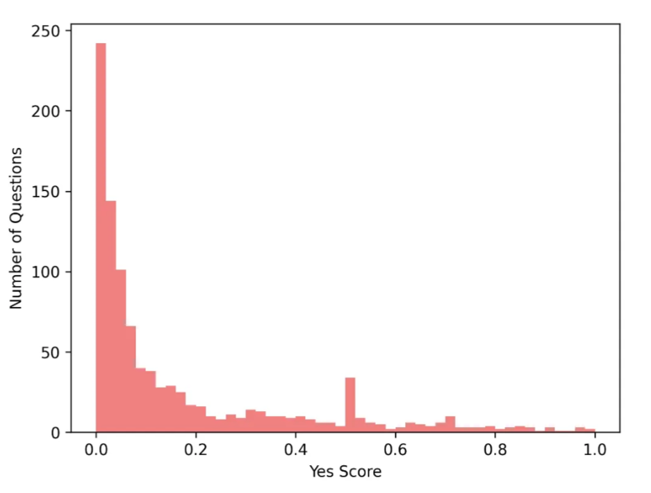
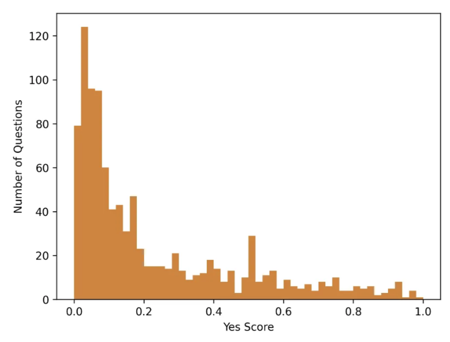
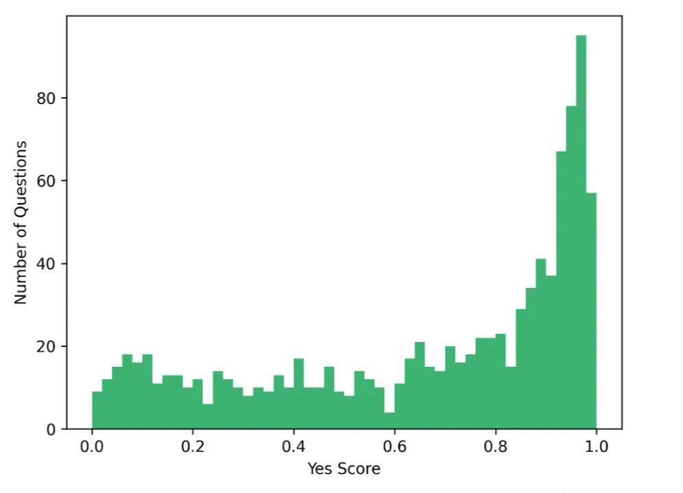

# Interne Demo: RAG-FAQ für OD

Dieses Projekt stellt eine interne Frage-Antwort-Anwendung bereit, die auf dem RAG-Ansatz (Retrieval-Augmented Generation) basiert. Die Daten aus einer CSV-Datei werden lokal in einer FAISS-Vektordatenbank gespeichert.

Die Antwortgenerierung erfolgt mithilfe der openai api (gpt-4-0125-preview) | aktuell NOCH cloudbasiert.


FAISS ist lokal (rag-bot-single\faiss_index) effizient und ideal für diese Demos.

## Funktionsweise

Das system durchsucht eine vektorisierte Datenbank nach den relevantesten Dokumenten und übergibt diese an ein LLM, das auf Grundlage dieser Informationen eine Antwort generiert.

## Aufbau

- Vektorbasierte Ähnlichkeitssuche mit FAISS  
- Einbindung eines GPT-Modells über die openai api  
- Konfiguration über `.env`-Datei  
- Lokale Nutzung ohne Cloud-Datenbank (NOCH ohne chroma)


## Einrichtung

1. Virtuelle Umgebung erstellen und aktivieren:
   ```bash
   python -m venv .venv
   .\.venv\Scripts\activate
   ```

2. Abhängigkeiten/requirements installieren:
   ```bash
   pip install -r requirements.txt
   ```

3. Umgebungsvariablen definieren (basierend von `.env.example`):
   ```env
   OPENAI_API_KEY=your-openai-key
   GPT_MODEL=gpt-3.5-turbo/gpt-4-0125-preview)
   ```


## Nutzung

1. Datenbank aus CSV-Datei erstellen:
   ```bash
   python create_database.py
   ```

2. Anwendung starten:
   ```bash
   python main.py
   ```


## Eigene Daten einbinden

Um eigene Fragen und Antworten zu verwenden, erstelle eine Datei unter `data/` mit folgendem Aufbau:

| Fragen            | Antworten                |
|------------------|--------------------------|
| Beispiel-Frage 1 | Beispiel-Antwort 1       |
| Beispiel-Frage 2 | Beispiel-Antwort 2       |

Die CSV-Datei sollte zwei Spalten mit den Titeln **Fragen** und **Antworten** enthalten.

## Projektstruktur

- `create_database.py` – Erstellt die FAISS-Datenbank  
- `query_data.py` – Vektorbasierte Suche und Antwortgenerierung  
- `main.py` – Einstiegspunkt zur Nutzung  
- `data/` – CSV-Dateien mit Fragen und Antworten  
- `faiss_index/` – Persistente Vektordatenbank  
- `.env.example` – Vorlage für Umgebungsvariablen  

---

## Anpassung des Confidence Scores

Um die Relevanz einer Antwort zu bewerten, wird ein sogenannter Confidence Score verwendet. Dieser Wert liegt zwischen `0` und `1` und gibt an, wie sicher das System ist, dass der zurückgegebene Kontext zur gestellten Frage passt.

### Code-Snippet zur Anpassung

In der Datei `query_data.py` (bzw. wo die `run_query()`-Funktion also liegt), kann der Confidence Score angepasst werden. Die Standardgrenze für die ich mich entschieden habe liegt bei `0.5`. Treffer darunter werden als irrelevant gewertet:

```python
if not results or results[0][1] < 0.5:
    return "KEINE PASSENDEN ERGEBNISSE GEFUNDEN. Bitte versuche es mit einer anderen Frage."
```

Durch Erhöhung oder Senkung dieser Grenze bzw. dieses Wertes lässt sich das Antwortverhalten feinjustieren:

---

### Visualisierung der Auswirkungen

Die folgenden Diagramme zeigen, wie sich unterschiedliche Scores auf die Erkennung von passenden Antworten auswirken:

#### Nicht passende Antworten (Incorrect Responses)
Antworten mit Score < 0.5, obwohl sie keine wirkliche Verbindung zur Frage haben:

```python
if not results or results[0][1] < 0.29:
```



#### Random Related Responses 
Lose verknüpfte, aber semantisch schwache Treffer mit mittlerem Score (0.3–0.6):

```python
if not results or results[0][1] < 0.54:
```



#### Passende Antworten (Correct Responses)
Hohe Scores (ab 0.7) – hier besteht starke Übereinstimmung zwischen Frage und gefundenem Kontext:

```python
if not results or results[0][1] < 0.86:
```



---

Je nach Use Case (präzision oder kulanz) ist dieser Wert frei anpassbar!

## Anforderungen

- Python 3.10 oder höher  
- openai API-Zugang