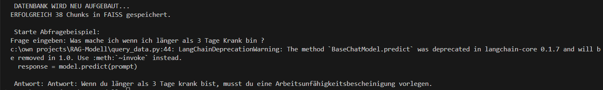

# Interne Demo: RAG-FAQ für OD

Dieses Projekt ist eine lokale Frage-Antwort-Anwendung auf Basis des RAG-Ansatzes (Retrieval-Augmented Generation). Die Daten aus einer CSV-Datei werden in einer FAISS-Vektordatenbank gespeichert, die OpenAI-API (GPT-3.5-Modell) wird zur Generierung der Antworten verwendet.

**Hinweis:** Hierbei wird FAISS statt ChromaDB verwendet, da es lokal einfacher einzurichten ist, weniger Ressourcen braucht und für eine schlanke, schnelle Demo vollkommen ausreicht


## Funktionsweise

Das system durchsucht eine vektorisierte Datenbank nach den relevantesten Dokumenten und übergibt diese an ein Sprachmodell, das auf Grundlage dieser Informationen eine Antwort generiert.

## Aufbau

- Vektorbasierte Ähnlichkeitssuche mit FAISS  
- Einbindung eines GPT-Modells über die OpenAI API  
- Konfiguration über `.env`-Datei  
- Lokale Nutzung ohne Cloud-Datenbank (Chroma wird nicht verwendet)  
- Modularer Aufbau über Python-Skripte  

## Einrichtung

1. Virtuelle Umgebung erstellen und aktivieren:
   ```bash
   python -m venv .venv
   .\.venv\Scripts\activate
   ```

2. Abhängigkeiten/requirements installieren:
   ```bash
   pip install -r requirements.txt
   ```

3. Umgebungsvariablen definieren (basierend von `.env.example`):
   ```env
   OPENAI_API_KEY=your-openai-key
   GPT_MODEL=gpt-3.5-turbo
   ```
> HINWEIS: In der `.env`-datei ist `gpt-3.5-turbo` hinterlegt.  
> Ich habe es gewählt, da es für einfache Textanfragen wie FAQ-Antworten schnell und effizient(und am günstigsten je token)ist


## Nutzung

1. Datenbank aus CSV-Datei erstellen:
   ```bash
   python create_database.py
   ```

2. Anwendung starten:
   ```bash
   python main.py
   ```



## Eigene Daten einbinden

Um eigene Fragen und Antworten zu verwenden, erstelle eine Datei unter `data/` mit folgendem Aufbau:

| Fragen            | Antworten                |
|------------------|--------------------------|
| Beispiel-Frage 1 | Beispiel-Antwort 1       |
| Beispiel-Frage 2 | Beispiel-Antwort 2       |

Die CSV-Datei sollte zwei Spalten mit den Titeln **Fragen** und **Antworten** enthalten.

## Projektstruktur

- `create_database.py` – Erstellt die FAISS-Datenbank  
- `query_data.py` – Vektorbasierte Suche und Antwortgenerierung  
- `main.py` – Einstiegspunkt zur Nutzung  
- `data/` – CSV-Dateien mit Fragen und Antworten  
- `faiss_index/` – Persistente Vektordatenbank  
- `.env.example` – Vorlage für Umgebungsvariablen  


## Anforderungen

- Python 3.10 oder höher  
- OpenAI API-Zugang